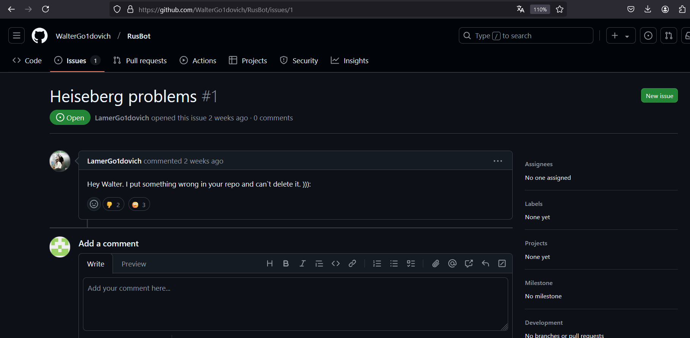
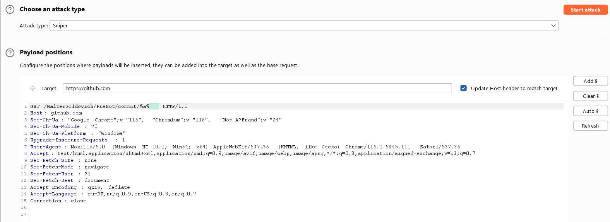
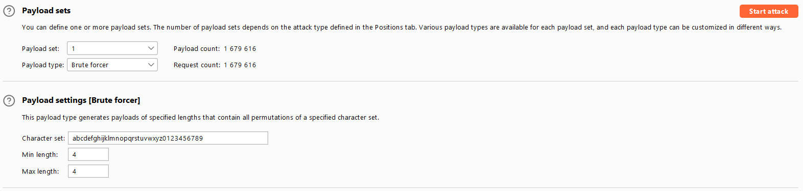

# GoidaHub
**Категория:** Карагандинские приколы (misc)\
**Автор:** Walter White\
**Количество решений:** 5\
**Категория:** Карагандинские приколы (misc)

Один Walter написал как-то очень давно великого русского тг бота(RusBot) и поделился им, но один неопытный пользователь компьютером допустил фатальную ошибку.

### Решение
Заходим на GitHub и ищем RusBot, а также выставляем сортировку по Recently Updated.  
Находим репозиторий [RusBot](https://github.com/WalterGo1dovich/RusBot) от `WalterGo1dovich`.  
Поглядев на репозиторий, можно увидеть открытый [Issue](https://github.com/WalterGo1dovich/RusBot/issues/1) от `LamerGo1dovich`.  
  
Скриншот Issue:

На основе него мы можем понять, что Ламер оставил что-то важное и не может это удалить.  
Погуглив немного находим [статью](https://trufflesecurity.com/blog/anyone-can-access-deleted-and-private-repo-data-github) по теме приватности гитхаба и бесконечной жизни коммитов.  
Прочитав статью, можно понять, что нам надо сбрутить 4-ех символьный хэш коммита.  
Это можно решить через код и апи гитхаба или через Burp Intruder(его я и покажу).  

Вот так надо все настроить:

  

В итоге мы славливаем хэш `40e9` и перейдя по [нему](https://github.com/WalterGo1dovich/RusBot/commit/40e9), получаем флаг.  
**флаг:** `goidactf{pr1vate_f0r_f0rkh4b}`  

~~ВСЁ ЧТО БЫЛО ЗАЛИТО НА ГИТХАБ, ОСТАЁТСЯ ТАМ ВЕЧНО~~
