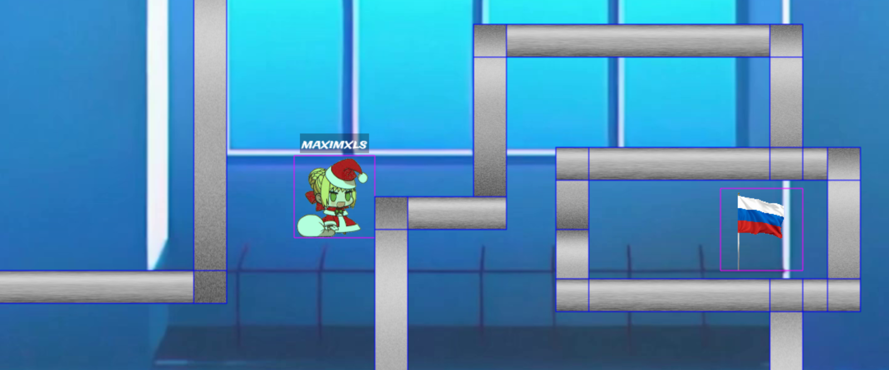

# С новым годом! 1
**Категория:** Нам и не нужон интернет ваш (Web)\
**Автор:** [maximxls](https://t.me/maximxlss)\
**Количество решений:** 16

С новым годом! К такому событию я накодил игру. Как же сложно проверять коллизии...\
Общедоступный инстанс: <больше не существует((>\
Этот таск - для флага 1! Флаг 2 сдается в  `С новым годом! 2`

### Решение
Заходим в код клиента, находим интересные места: `setCollideWorldBounds`, `cameras.main.setBounds` и другие. Можно все это прогуглить, поэкспериментировать. В итоге задумано прийти к использованию local overrides в devtools браузера для редактирования кода таким образом, чтобы убрать границы карты, заставить камеру следовать за персонажем, обеспечить свободный полет и установку координат на точные значения, а так же включить режим дебага физики и реализовать эксплоит для второго флага.

Все это и чуть больше можно найти в моём чите [cheat.js](./cheat.js). Чтобы его использовать, нужно включить local overrides в браузере и заменить game.js на содержимое [cheat.js](./cheat.js). Чтобы узнать, что конкретно изменено в чите, используйте любой способ сранения кода (diff, vscode compare, etc.)

Из первой коробки можно просто вылетить, так как границы игрового поля сервер не проверяет. Далее нужно исследовать античит и выявить проблемы: 

Первый флаг:


Чтобы проникнуть внутрь, нужно пройти через касающиеся коллайдеры, которые видно на скриншоте. Это можно определить, анализируя функцию, которая проверяет коллизии двух отрезков на сервере. Нужно обратить внимание на следующую проверку на строке 82: 
```javascript
return x1 <= x3 && x3 <= x2 && ((y3 < y && y < y4) || (y4 < y && y < y3))
```
Попадание горизонтального отрезка в вертикальный проверяется некорректно: коллизия с самыми краями вертикального отрезка не определяется в связи с строгим знаком неравества (эта ошибка есть только в этой проверке, а не в других).\
Кроме того, в последней проверке можно заметить, что два параллельных отрезка тоже никогда не определяются, как пересекающиеся.
Эти два факта означают, что можно пройти прямо по горизонтальной стороне коллайдера, например, через щель нулевой ширины в стенах коробки.

Чтобы эксплуатировать эту уязвимость в моем чите можно подлететь к щели, изменить y на ровно 310 (вписав в третье поле в левом верхнем углу число и нажав Enter), а затем нажать Shift+Right. Это повторить для второй щели (y=350). При касании флага, флаг будет напечатан в консоль браузера.

Получение второго флага, альтернативный путь и дополнительная информация о таске описаны в [соответсвующем райтапе](../с%20новым%20годом%202/README.md).
