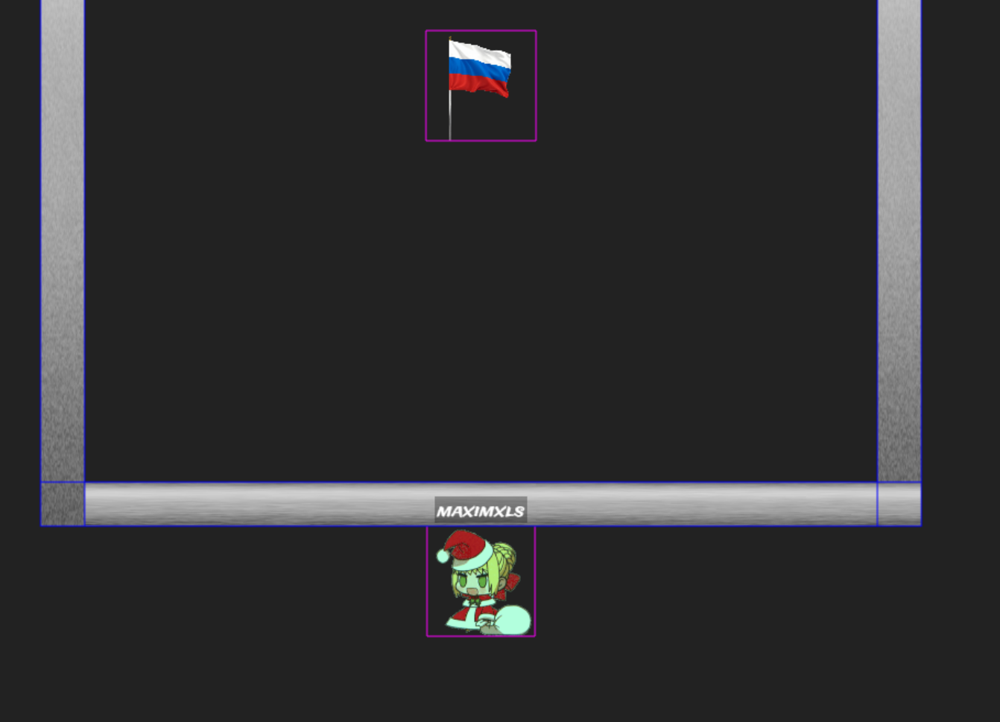
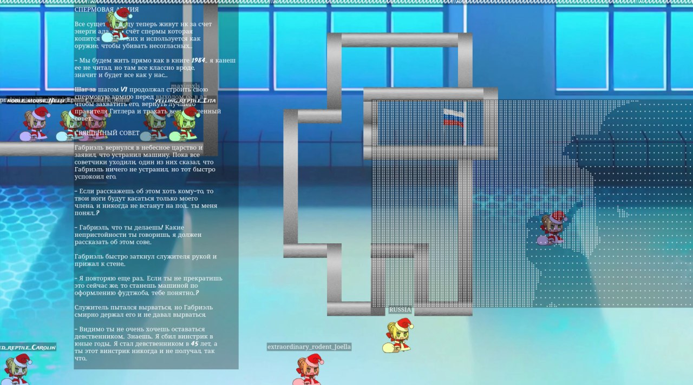
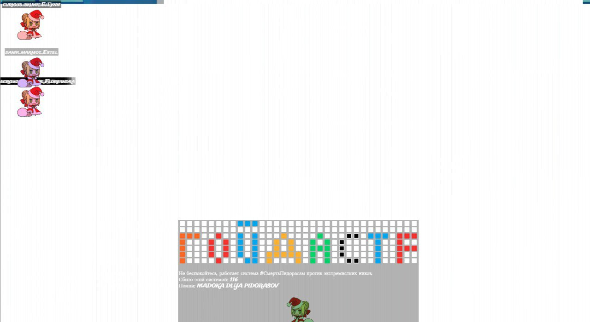

# С новым годом! 2
**Категория:** Нам и не нужон интернет ваш (Web)\
**Автор:** [maximxls](https://t.me/maximxlss)\
**Количество решений:** 9

Представляете, два таска в одном! Вот это технологии!\
Общедоступный инстанс: <больше не существует((>\
Этот таск - для флага 2! Флаг 1 сдается в  `С новым годом! 1`! ~~Там же можно запустить свой инстанс.~~

### Решение
Второй флаг:

Располагается под картой. Так как коробка расположена на координате x=0, можно двинуться с $(0, y)\to(10^{-323}, y + 100)$ и не потерять в точности. Это приведет к $k=\infty$, а в IEEE 754 $y=k\cdot x=\infty\cdot 0=NaN$. Все сравнения обратятся в $false$ и античит посчитает, что траектория нормальная.

В моем чите это движение реализовано на Shift+Up.

Кроме того, существует неожиданное решение, связанное с округлениями флоатов. При правильных условиях при траетории под большим углом, можно проникнуть на край, а затем внутрь коллайдера, в результате удачного округления результатов вычислений. Этот метод в том числе подходит для получения первого флага. Спасибо, @twtzz!

Кроме того, существует еще одно неожиданное решение, которое использует принцип из задуманного решения, но бесконечность образуется в результате уже огромного изменения в координате, деленного на маленькое. Однако, там эксплуатируется конкретно проверка y, которая никогда не пройдет, если $y=\infty$. Этот трюк позволяет проходить вообще через любые стены. Спасибо, @kukakur!

### Другие функции игры
В игре можно было менять ник, без ограничения на длину или символы. Это позволило в определенный момент творить всякие разные штуки по типу рисования анимации Bad Apple!

### Проблемы
При эксплуатации ников игра порождала высокую нагрузку на сеть, вплоть до десятков мегабит. Легко было сконструировать на этом и метод полного ддоса, что в определенный момент и произошло.

Следя за координатами игроков, на общем инстансе можно было увидеть, как другие исполняют эксплоиты. Однако, это не было большой проблемой, ведь игру можно было проэксплуатировать на личном инстансе.
